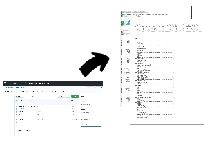

[](https://codecov.io/gh/isidroas/code_to_pdf)
[](https://github.com/isidroas/code_to_pdf/actions/workflows/github-actions-test.yaml)
[](http://mypy-lang.org/)


# PDF code proyect generator

Spending many hours in front of a screen can be tiring. Sometimes we need to analyze libraries that are used in our application and to give our eyes a break, this program could be usefull. Its input is a folder that contains files of code, and the output is a pdf document of highlighted source. Also, at the beginning an index is added, which indicates the page number per each file of code.



## Installation
```bash
pip install code_to_pdf
```

## Usage
```
code_to_pdf --output-file output_document.pdf  path/to/project/dir/
```
It will generate a file named "ouptut_document.pdf"
