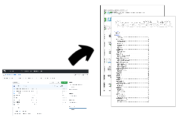

# PDF code project generator

Spending many hours in front of a screen can be tiring. Sometimes we need to analyze libraries that are used in our application and to give our eyes a break, this program could be useful. Its input is a folder that contains files of code, and the output is a PDF document of highlighted source. Also, at the beginning an index is added, which indicates the page number per each file of code.



## Installation
```bash
pip install code_to_pdf
```

## Usage
```
code_to_pdf --title output_document  path/to/project/dir/
```
It will generate a file named "output_document.pdf"
